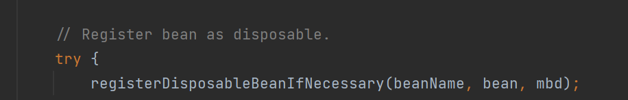
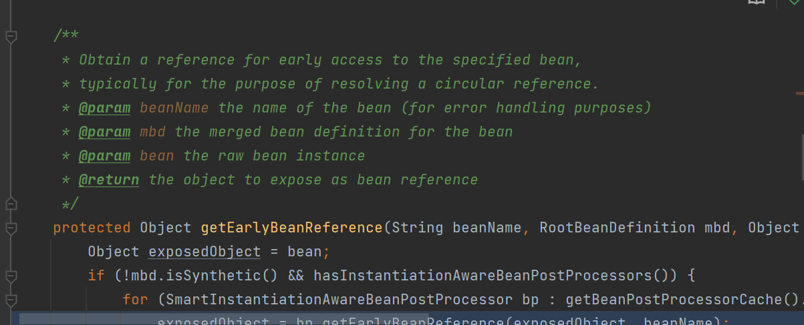

# 后置处理器的执行时期

执行顺序

bean 


```
resolveBeforeInstantiation
```

​      InstantiationAwareBeanPostProcessor postProcessBeforeInstantiation() 然后再进入  doCreateBean()

doCreateBean -> createinstance（）  


```（
applyMergedBeanDefinitionPostProcessors（）


```

放入三级缓存bean工厂

```（）
populateBean（）
	先执行   InstantiationAwareBeanPostProcessor（） postProcessAfterInstantiation
	populateBean（）
```

```（）
initializeBean（）
  	 invokeAwareMethods（）
  	 applyBeanPostProcessorsBeforeInitialization  （beanPostProcessor) 
  	 invokeInitMethods(beanName, wrappedBean, mbd);
  	 applyBeanPostProcessorsAfterInitialization (beanPostProcessor)
```





