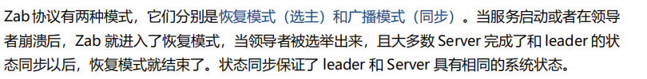
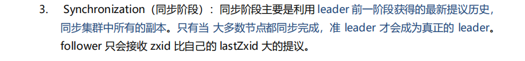
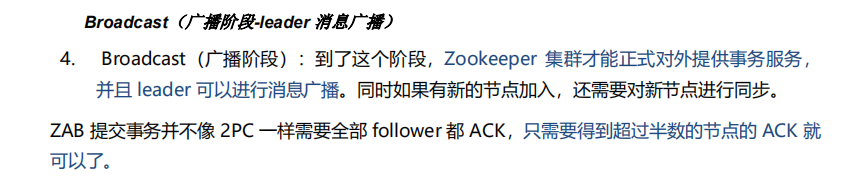
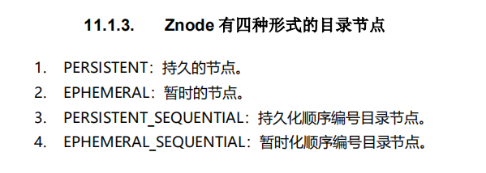

Zookeeper atomic broadcast 

原子消息广播协议 

协议的事务编号zxid设计中，zxid是一个64位的数字，低32位是一个简单的单调递增计数器，针对客户端每一个事务请求，计数器加1.高32位则代表leader周期epoch的编号。

每个当选产生一个新的leader服务器，就会从这个leader服务器上取出本地日志中最大事务的zxid，并从中读取epoch值，然后加1，以此作为新的epoch，并将从低32位从0开始计数。

zxid（transaction id)类似rmrms的事务id，用于标识一次更新操作的proposal id 。为了保证顺序，这个必须单调递增。

zab协议有两种模式，恢复模式（选主） 广播模式（同步）

#### ZAB协议4阶段

##### Leader election （选举阶段-选出准Leader)

节点一开始都处于选举阶段，只要有一个节点得到超过半数节点的选票，它就可以当选准leader。只有到达广播阶段。准leader才会成为真正的leader。

##### Discovery发现阶段

在这个阶段follwers跟准leader进行通信，同步follwers最近接收的事务协议。这一阶段目的是发现大多数节点接收的最新提议，并且准leader生成新的epoch，让follwer接收

##### 同步阶段 synchronization (同步阶段 同步 follwers副本)

ZAB工作原理

(Zookeeper Atmoic Broadcast)的核心是原子广播，这个机制保证了各个Server之间的同步，实现这个机制的协议叫做Zab协议。Zab协议有两种模式 分别是恢复模式 和 广播模式。

当服务启动或者在领导者奔溃的时候，Zab就进入了恢复模式，当领导者被选举出来，且大多数server完成了和leader的状态同步后，恢复模式就结束了

状态同步保证了leader和server具有相同的系统状态

广播模式需要保证proposal被按顺序处理，因此zk采用了递增的事务id（zxid）来保证。所有的提议proposal都在被提出的时候加上了zxid

