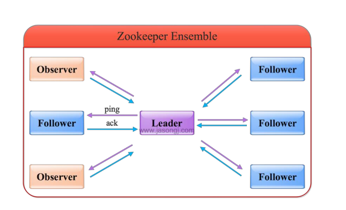

Zookeeper是一个分布式协调服务，可用于服务发现，分布式锁，分布式领导选举，配置管理等。

Zookeeper提供了一个类似于Linux文件系统的树形结构。

认为是轻量级的内存文件系统，但只适合存少量信息，不适合存储大量文件。同时提供了对于每个节点的监控和通知机制。

#### Zookeeper角色

Zookeeper集群是一个基于主从复制的高可用集群。

##### Leader

一个Zookeeper集群同时只会有一个实际工作的Leader，会维护各Follwer和Observer的心跳。

所有的写操作必须通过Leader完成再由leader将写操作广播给其他服务器。只要有超过半数节点，该写请求就会被提交。（类2pc)

##### Follwer

一个Zookeeper集群可能存在多个Follwer，会响应leader的心跳。

Folllower可直接处理并返回客户端的读请求，同时将写请求转发给Leader处理

负责在Leader处理写请求时对请求进行投票

#### Observer

角色与Follwer类似，但是没有投票权，Zookeeper需要保证高可用和强一致性，为了支持更多的客户端，需要增加更多Server；Server增多，投票阶段延迟就增大，影响性能。引入Observer，Observer不参与投票。Observer接收客户端连接，把xie'qing'qiu转发给Leader节点，加入更多Observer节点，提高伸缩性，不影响吞吐。

