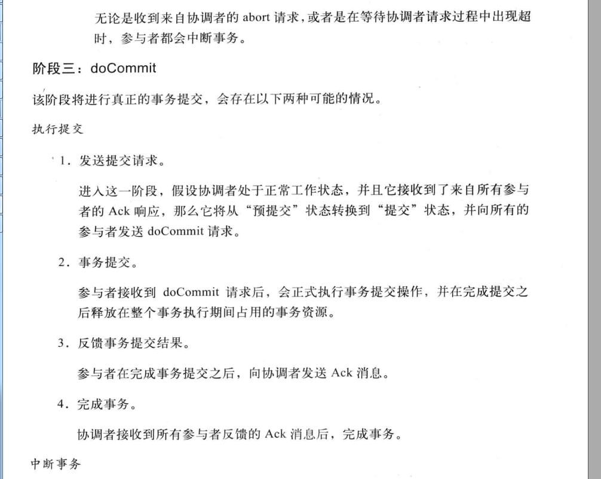

# 一致性协议

## 2PC——Two Phase Commit  二阶段提交

大体来说分为两个阶段

## 二阶段提交的优点

实现简单，方便

## 二阶段提交的缺点

同步阻塞，单点， 脑裂 ，保守

##### 同步阻塞

各个参与者都在等待其他参与者参加，这个过程中无法进行其他操作

##### 单点问题

协调者非常重要，如果协调挂了，所有参与者都会处于待提交状态。

事务被锁定，无法完成事务操作

##### 数据不一致

如果出现了部分参与者的网络波动，只有部分参与者执行了commit 操作 ，那么会导致 没有接受到commit请求的参与者的数据 与其他机器不一致。

##### 太过保守

比如一台参与者出现故障 迟迟没有提交， 那么协调者只能依靠自身的超时机制来判断是否需要中断事务，这策略比较保守，任何节点的失败 都会导致整个二阶段事务的失败。

## 3PC —— 3 PHASE COMMIT

将二阶段提交协议的提交 事务请求流程1分为2 由CanCommit、 PreCommit 、 do Commit 三个阶段组成的事务处理协议。

如果在do commit 阶段 出现网络问题 或者协调者故障。这样都会导致 参与者等待超时，

这种情况下 参与者会继续提交事务。

#### 3PC的优点

相较于2PC提交，3PC最大优点降低参与者阻塞范围，在出现单点故障后保持一致。

#### 3PC的缺点

在preCommit 后，如果网络出现分区 ，无法通行，参与者会进行事务的提交，必然导致数据的不一致性。

