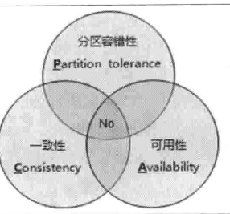
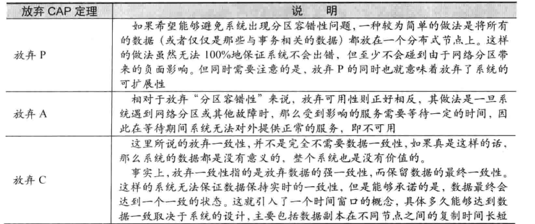
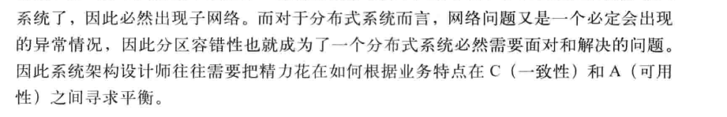
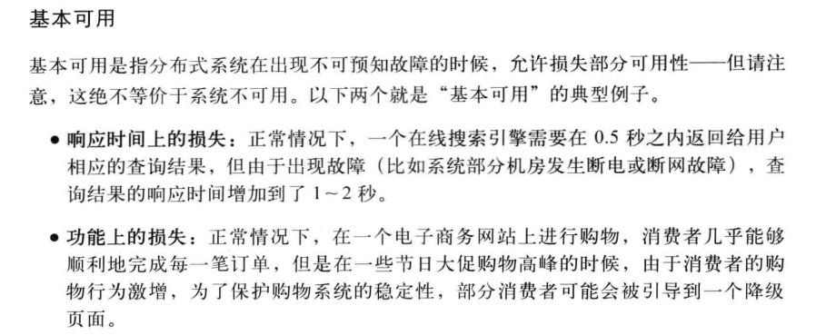

# 分布式的基本说明

## 分布式CAP

C （一致性） A(可用性) P(分区容错性)

从这些考虑出发 实际上C的强一致性 是可以被舍弃的 

书中的结论是 P是不可以作为讨论选项的 

## Base理论

Base ==  Basically Availiable（基本可用） + Soft state （软状态）+ Eventually consistent (最终一致性)

### 基本可用

不等于停止服务，而是损失部分的可用性 比如增加响应时间 功能损失等

### 软状态

### 最终一致性

系统中所有的数据副本， 经过一段时间的同步过后 最终能达到一个一致性状态。因此不需要强调实时保持系统数据的一致性。

