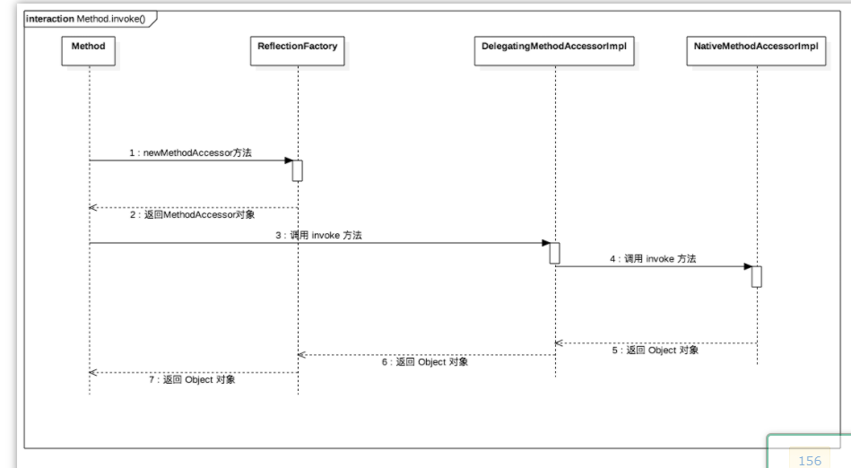

## 反射常用API


### 获取反射中的Class对象

在反射中，要获取一个类或调用一个类的方法，我们首先需要获取到该类的 Class 对象。

在 Java API 中，获取 Class 类对象有三种方法：

**第一种，使用 Class.forName 静态方法。**当你知道该类的全路径名时，你可以使用该方法获取 Class 类对象。

```
Class clz = Class.forName("java.lang.String");
```

**第二种，使用 .class 方法。**

这种方法只适合在编译前就知道操作的 Class。

```
Class clz = String.class;
```

**第三种，使用类对象的 getClass() 方法。**

```
String str = new String("Hello");
Class clz = str.getClass();
```


### 通过反射创建类对象

通过反射创建类对象主要有两种方式：通过 Class 对象的 newInstance() 方法、通过 Constructor 对象的 newInstance() 方法。

第一种：通过 Class 对象的 newInstance() 方法。

```
Class clz = Apple.class;
Apple apple = (Apple)clz.newInstance();
```

第二种：通过 Constructor 对象的 newInstance() 方法

```
Class clz = Apple.class;
Constructor constructor = clz.getConstructor();
Apple apple = (Apple)constructor.newInstance();
```

通过 Constructor 对象创建类对象可以选择特定构造方法，而通过 Class 对象则只能使用默认的无参数构造方法。下面的代码就调用了一个有参数的构造方法进行了类对象的初始化。

```
Class clz = Apple.class;
Constructor constructor = clz.getConstructor(String.class, int.class);
Apple apple = (Apple)constructor.newInstance("红富士", 15);
```


### 通过反射获取类属性、方法、构造器

我们通过 Class 对象的 getFields() 方法可以获取 Class 类的属性，但无法获取私有属性。

```
Class clz = Apple.class;
Field[] fields = clz.getFields();
for (Field field : fields) {
    System.out.println(field.getName());
}
```

输出结果是：

```
price
```

而如果使用 Class 对象的 getDeclaredFields() 方法则可以获取包括私有属性在内的所有属性：

```
Class clz = Apple.class;
Field[] fields = clz.getDeclaredFields();
for (Field field : fields) {
    System.out.println(field.getName());
}
```

输出结果是：

```
name
price
```

与获取类属性一样，当我们去获取类方法、类构造器时，如果要获取私有方法或私有构造器，则必须使用有 declared 关键字的方法。


从这个简单的例子可以看出，一般情况下我们使用反射获取一个对象的步骤：

- 获取类的 Class 对象实例

```
Class clz = Class.forName("com.zhenai.api.Apple");
```

- 根据 Class 对象实例获取 Constructor 对象

```
Constructor appleConstructor = clz.getConstructor();
```

- 使用 Constructor 对象的 newInstance 方法获取反射类对象

```
Object appleObj = appleConstructor.newInstance();
```

而如果要调用某一个方法，则需要经过下面的步骤：

- 获取方法的 Method 对象

```
Method setPriceMethod = clz.getMethod("setPrice", int.class);
```

- 利用 invoke 方法调用方法

```
setPriceMethod.invoke(appleObj, 14);
```


Native 版本一开始启动快，但是随着运行时间边长，速度变慢。Java 版本一开始加载慢，但是随着运行时间边长，速度变快。正是因为两种存在这些问题，所以第一次加载的时候我们会发现使用的是 NativeMethodAccessorImpl 的实现，而当反射调用次数超过 15 次之后，则使用 MethodAccessorGenerator 生成的 MethodAccessorImpl 对象去实现反射。

讲到这里，我们了解了 Method 类的 invoke 方法的具体实现方式。知道了原来 invoke 方法内部有两种实现方式，一种是 native 原生的实现方式，一种是 Java 实现方式，这两种各有千秋。而为了最大化性能优势，JDK 源码使用了代理的设计模式去实现最大化性能。

