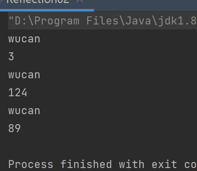
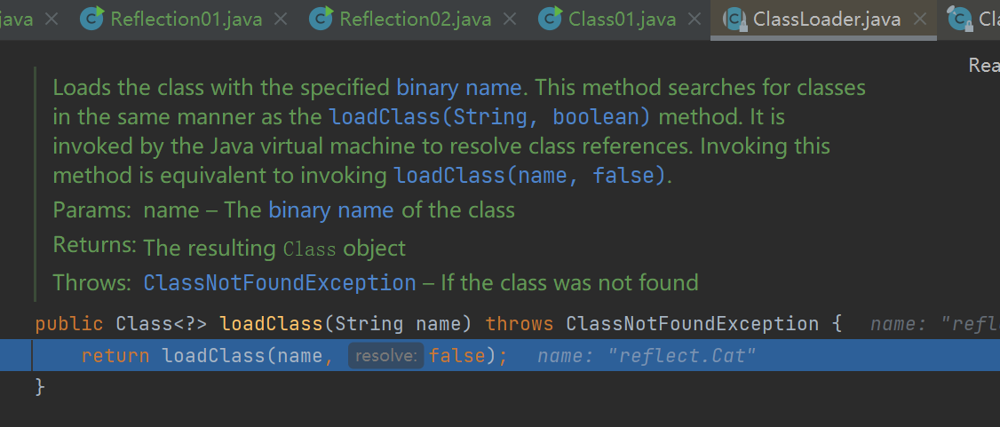

[TOC]

## 反射机制

#### 原理图

#### 反射优缺点

##### 优点

动态的创建适用对象使用灵活

##### 缺点

解释执行 速度很慢

可以关闭安全检查 提高一点点速度

## Class类

#### class类图

不管是new 还是执行反射创建都调用了类加载器 

类对象只加载一次

#### 获取类对象的方法

Class.forname();

Classloader();

Object.getClass();

Car.class();

## 类加载

#### 静态加载

j

#### 动态加载

运行时加载 没有用到的时候并不会报错

### 类加载时机

 创建对象的时候

子类被创建的时候 父类

调用类中的静态成员 

通过反射 加载

### 类加载的流程图

准备阶段进行默认初始化

初始化实际上就是显式初始化

Loading和linking这个是jvm控制的程序员无法控制 

初始化这里是程序员可以控制的

### 加载阶段

从不同数据源 二进制数据加载到内存中（方法区）,同时生成一个Class对象（堆）

### 验证阶段 连接的子阶段

确保加载的二进制数据不会危害到jvm的安全

进行一些列的验证 文件格式 元数据 符号应用验证

### 准备阶段 连接的子阶段

jvm会对静态变量分配内存 并进行初始化 比如int 默认给0这样  String null 一般在方法区里分配

常量在准备阶段直接就赋值了

### 解析阶段 连接的子阶段 

虚拟机将常量池的符号引用替换为直接引用的过程

### 初始化

真正执行类中定义的代码 当然 这里也还是静态代码的过程

### 通过反射获得类的结构信息