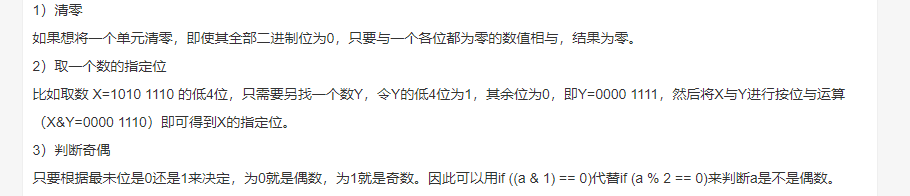
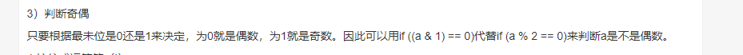
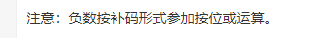
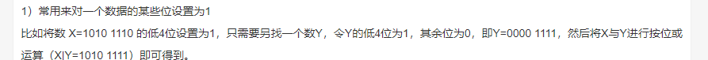
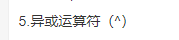
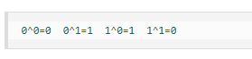
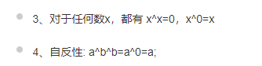
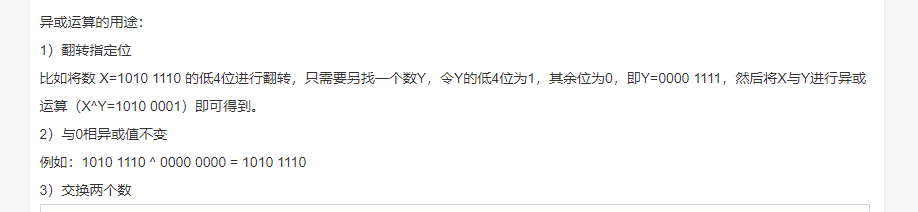

#### &

1&1 = 1 1&0 = 0 0&0 = 0  

结论 1 & 1 才为1 其他都为0

#### |

或运算

0|0 = 0          1|0 = 1        0|1 = 1  1|1 = 1

只要参与的一个为1 那么结果就为1

###### 

#### 异或运算

#### ~ 取反

~1 = 0         ~0=1

#### << 左移 运算符

#### \> \> 右移 运算符

右移 补充的是符号位