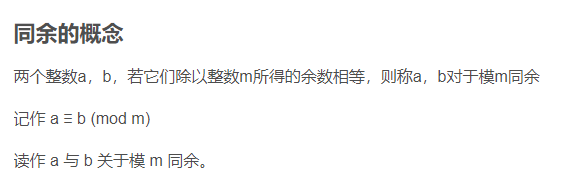

#### 8位无符号 与 8位有符号的区别

二进制 用第一位来表示符号

也就是无符号的二进制8位表示的范围是0-255 也就是0000 0000 1111 1111

而有符号的第一位 0（正数） 1（负数） 来标识 范围也就是 0111 1111 1111 1111 也就是-127 127

#### 反码

反码的表示方法

正数的反码是其本身

负数的反码是原码基础上，符号位不变，其余各个位取反

【+1】 0000 0001 原 == 0000 0001 反

【-1】 1000 0001 原 = 1111 1110 反

可见如果一个反码表示的是负数, 人脑无法直观的看出来它的数值. 通常要将其转换成原码再计算.

#### 补码

正数的补码就是本身

负数的补码是在原码的基础上，符号位不变，其余各位取反，最后+1

【+1】 0000 0001 原 == 0000 0001 补

【-1】 1000 0001 原 = 1111 1111 补

对于负数, 补码表示方式也是人脑无法直观看出其数值的. 通常也需要转换成原码在计算其数值.

#### 为什么要有补码 反码

本质上是为了方便计算机 做减法运算 处理0的结果

发现用反码计算减法, 结果的真值部分是正确的. 而唯一的问题其实就出现在"0"这个特殊的数值上. 虽然人们理解上+0和-0是一样的, 但是0带符号是没有任何意义的. 而且会有[0000 0000]原和[1000 0000]原两个编码表示0

在采用补码形式表示时，进行加法运算可以把符号位和数值位一起进行运算(若符号位有进位，导致了益出，则直接舍弃)，结果为两数之和的补码形式。.

于是补码的出现, 解决了0的符号以及两个编码的问题:

1-1 = 1 + (-1) = [0000 0001]原 + [1000 0001]原 = [0000 0001]补 + [1111 1111]补 = [0000 0000]补=[0000 0000]原

这样0用[0000 0000]表示, 而以前出现问题的-0则不存在了.而且可以用[1000 0000]表示-128:

使用补码, 不仅仅修复了0的符号以及存在两个编码的问题, 而且还能够多表示一个最低数. 这就是为什么8位二进制, 使用原码或反码表示的范围为[-127, +127], 而使用补码表示的范围为[-128, 127].

因为机器使用补码, 所以对于编程中常用到的32位int类型, 可以表示范围是: [-231, 231-1] 因为第一位表示的是符号位.而使用补码表示时又可以多保存一个最小值.

> 4 mod 12 = 4
>
> 16 mod 12 = 4
>
> 28 mod 12 = 4

所以4, 16, 28关于模 12 同余.