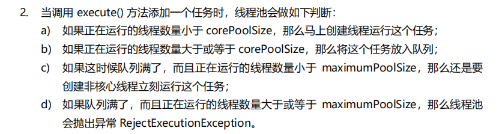
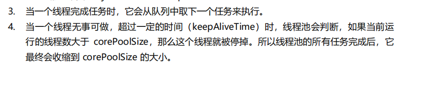
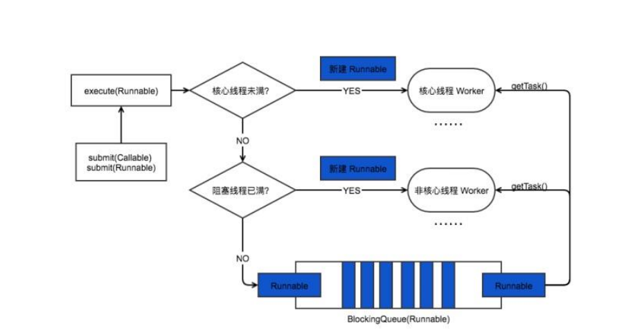
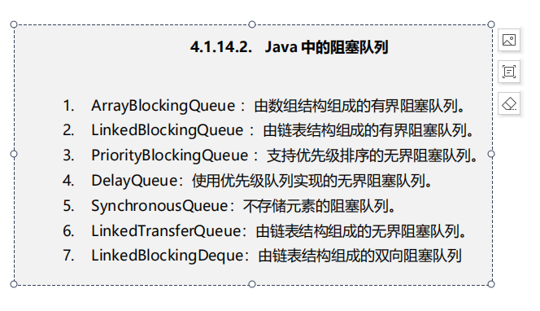
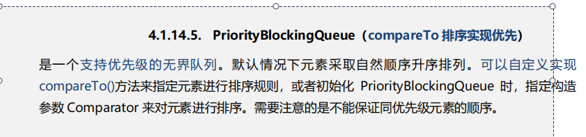
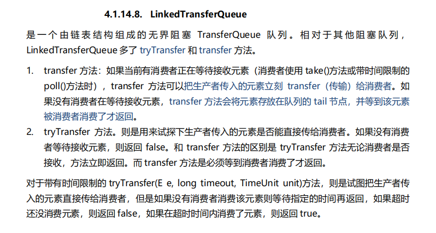

1.newCacheThreadPool

无界无缓存 默认最大 SynchonziedBlockingQueue

2.newFixedThreadPool

无界有缓存 默认是LinkedBlockingQueue

超出maxThread的被丢到链表中 等待执行

3.newSingleThreadPool


4.newScheludledThreadPool 

```
DelayedWorkQueue
```

实现了一种按照执行事件排序的队列

这个实际上就是一个数组实现的堆，有优先级

还有一种有界有缓存就是 ArrayBlockingQueue 有固定的容量

队列拒绝策略

1.CallerRunsPolicy 这个就是当前线程来执行这个被丢弃的任务

2.Abort 抛出异常 这是上诉四个线程池的默认实现

3.Discard 啥都不做 就是丢弃这个任务了

4.DiscardOldest  从队列中取出下个将要执行的任务，丢弃。 然后放入排不进去的这个任务











