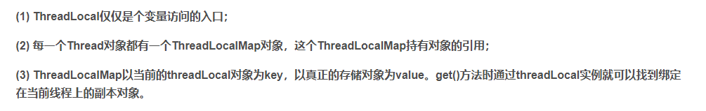
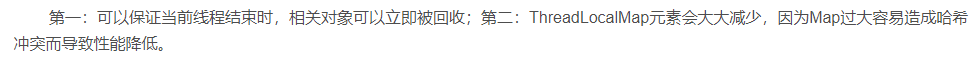

线程本地存储


大体上是为了每个线程提供局部变量


我之前有写过类似于

set

首先获取自身的线程

然后以这个获取线程上的ThreadLocalMap对象





然后再以ThreadLocal作为key获取对应的值

```
public void set(T value) {
	//获取目前的线程
    Thread t = Thread.currentThread();
    //这个ThreadLocalMap实际上存储在Thread的ThreadLocals成员上
    ThreadLocalMap map = getMap(t);
    if (map != null)
    	//最后key实际上是ThreadLocal这个对象
        map.set(this, value);
    else
        createMap(t, value);
}
```