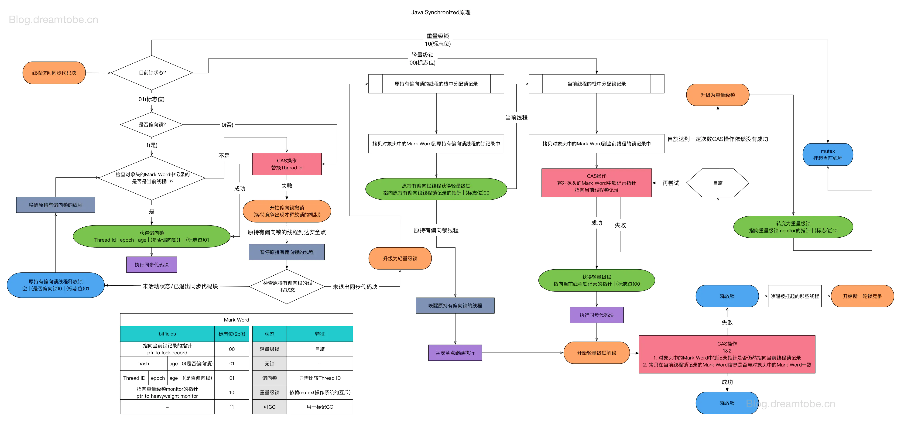

# 浅谈偏向锁、轻量级锁、重量级锁

为了换取性能，JVM在内置锁上做了非常多的优化，膨胀式的锁分配策略就是其一。理解偏向锁、轻量级锁、重量级锁的要解决的基本问题，几种锁的分配和膨胀过程，有助于编写并优化基于锁的并发程序。

内置锁是JVM提供的最便捷的线程同步工具，在代码块或方法声明上添加synchronized关键字即可使用内置锁。使用内置锁能够简化并发模型；随着JVM的升级，几乎不需要修改代码，就可以直接享受JVM在内置锁上的优化成果。从简单的重量级锁，到逐渐膨胀的锁分配策略，使用了多种优化手段解决隐藏在内置锁下的基本问题。

