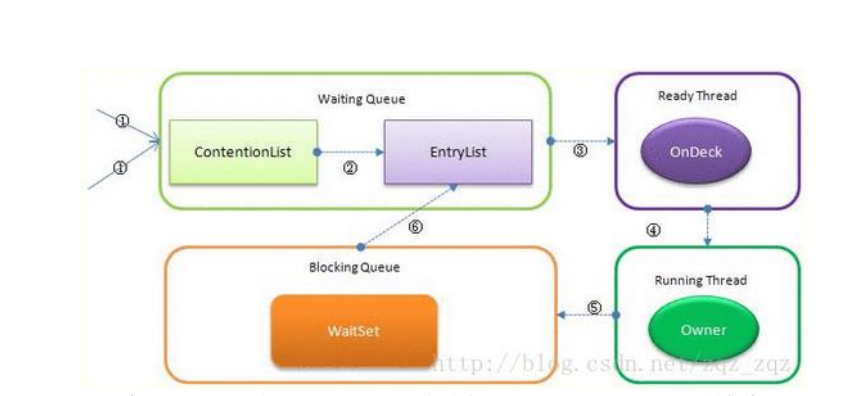
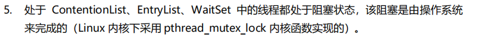
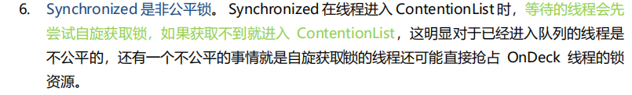

竞争的线程被放入contentionList 

此时owner线程要释放锁unlock的时候，

从contentionlist中移动部分线程到EntryList中，并从中选择一个作为on deck（竞争候选）线程 ，

然后把锁竞争的权力交给他 ondecki

就成了running线程

如果running线程被sleep等原因阻塞，那么将他移动到waitset中，

如果有notify 或者notifyAll 会重新进入到entryList中

