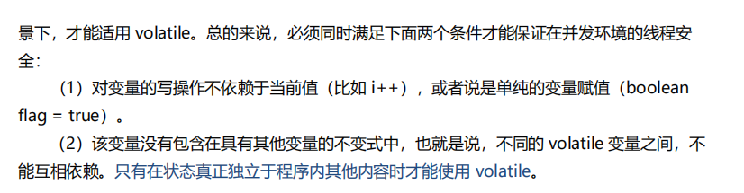

volatile变量不会被缓存再寄存器或对其他处理器不可见的地方，因此读取volatile总是会返回最新写入的值

volatile变量提供了一个机制，一个变量被多个线程共享，线程直接给这个变量赋值。

当对非volatile变量进行读写的时候，每个线程先从内存拷贝变量到cpu缓存中，

每个线程可能在不同cpu上被处理，所以会拷贝到不同的cpucache中，

声明变量是volatile的，JVM保证每次读变量都从内存中读，跳过了cpu cache这一步。

指令重排一般分为以下三种：

- **编译器优化重排**

  编译器在**不改变单线程程序语义**的前提下，可以重新安排语句的执行顺序。

- **指令并行重排**

  现代处理器采用了指令级并行技术来将多条指令重叠执行。如果**不存在数据依赖性**(即后一个执行的语句无需依赖前面执行的语句的结果)，处理器可以改变语句对应的机器指令的执行顺序。

- **内存系统重排**

  由于处理器使用缓存和读写缓存冲区，这使得加载(load)和存储(store)操作看上去可能是在乱序执行，因为三级缓存的存在，导致内存与缓存的数据同步存在时间差。

**指令重排可以保证串行语义一致，但是没有义务保证多线程间的语义也一致**。所以在多线程下，指令重排序可能会导致一些问题。