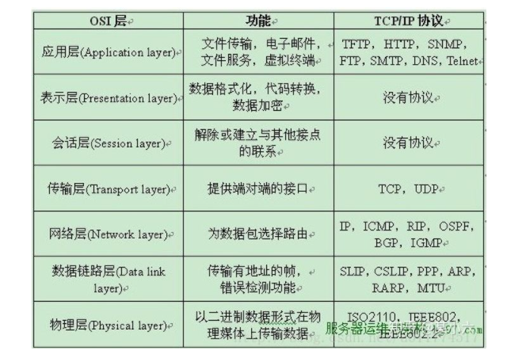
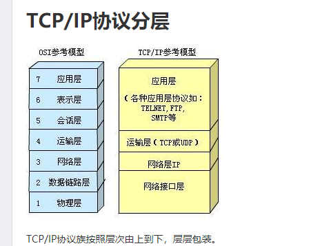

**应用层**:
向用户提供一组常用的应用程序，比如电子邮件、文件传输访问、远程登录等。远程登录TELNET使用TELNET协议提供在网络其它主机上注册的接口。TELNET会话提供了基于字符的虚拟终端。文件传输访问FTP使用FTP协议来提供网络内机器间的文件拷贝功能。

**传输层**:
提供应用程序间的通信。其功能包括：一、格式化信息流；二、提供可靠传输。为实现后者，传输层协议规定接收端必须发回确认，并且假如分组丢失，必须重新发送。

**网络层** ：
负责相邻计算机之间的通信。其功能包括三方面。
一、处理来自传输层的分组发送请求，收到请求后，将分组装入IP数据报，填充报头，选择去往信宿机的路径，然后将数据报发往适当的网络接口。

二、处理输入数据报：首先检查其合法性，然后进行寻径--假如该数据报已到达信宿机，则去掉报头，将剩下部分交给适当的传输协议；假如该数据报尚未到达信宿，则转发该数据报。

三、处理路径、流控、拥塞等问题。

**网络接口层**：
这是TCP/IP软件的最低层，负责接收IP数据报并通过网络发送之，或者从网络上接收物理帧，抽出IP数据报，交给IP层。

解决两个硬件之间怎么通信的问题，常见的物理媒介有光纤、电缆、中继器等。它主要定义物理设备标准，如网线的接口类型、光纤的接口类型、各种传输介质的传输速率等。

它的主要作用是传输比特流（就是由1、0转化为电流强弱来进行传输，到达目的地后在转化为1、0，也就是我们常说的数模转换与模数转换）。这一层的数据叫做比特。**管理通信设备和网络媒体之间的互联互通。**

- **数据链路层：**

在计算机网络中由于各种干扰的存在，物理链路是不可靠的。该层的主要功能就是：通过各种控制协议，将有差错的物理信道变为无差错的、能可靠传输数据帧的数据链路。

它的具体工作是接收来自物理层的位流形式的数据，并封装成帧，传送到上一层；同样，也将来自上层的数据帧，拆装为位流形式的数据转发到物理层。这一层的数据叫做帧。**提供介质访问和链路管理。**

- **网络层：**

计算机网络中如果有多台计算机，怎么找到要发的那台？如果中间有多个节点，怎么选择路径？这就是路由要做的事。

该层的主要任务就是：通过路由选择算法，为报文（该层的数据单位，由上一层数据打包而来）通过通信子网选择最适当的路径。这一层定义的是IP地址，通过IP地址寻址，所以产生了IP协议。**IP选址及路由选择。**

- **传输层：**

当发送大量数据时，很可能会出现丢包的情况，另一台电脑要告诉是否完整接收到全部的包。如果缺了，就告诉丢了哪些包，然后再发一次，直至全部接收为止。

简单来说，传输层的主要功能就是：监控数据传输服务的质量，保证报文的正确传输。**数据通信**

- **会话层：**

虽然已经可以实现给正确的计算机，发送正确的封装过后的信息了。但我们总不可能每次都要调用传输层协议去打包，然后再调用IP协议去找路由，所以我们要建立一个自动收发包，自动寻址的功能。于是会话层出现了：它的作用就是建立和管理应用程序之间的通信。**创建、管理和维护会话。**

- **表示层：**

表示层负责数据格式的转换，将应用处理的信息转换为适合网络传输的格式，或者将来自下一层的数据转换为上层能处理的格式。**数据编码、格式转换、数据加密**

- **应用层：**

应用层是计算机用户，以及各种应用程序和网络之间的接口，其功能是直接向用户提供服务，完成用户希望在网络上完成的各种工作。前端同学对应用层肯定是最熟悉的。**为应用程序或用户请求提供各种请求服务**

