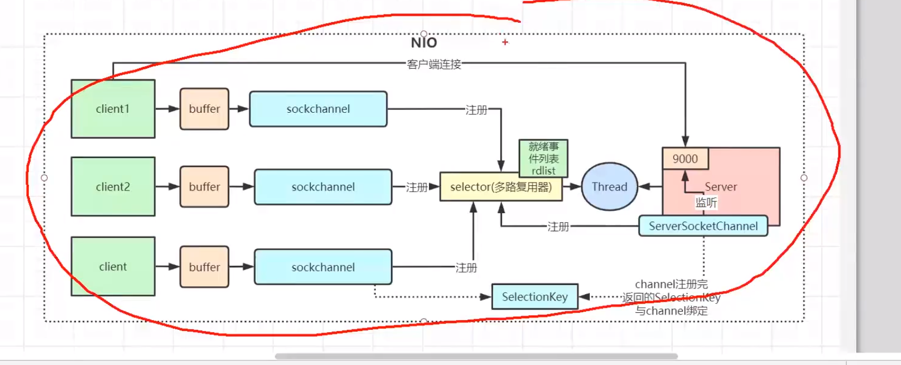

### 

# BIO

# NIO

Selector 收集读写数据的channel

server accept 事件  发生

select 方法 

Selector是个集合 遍历事件    key——> channel 

读写事件 

服务端 发生事件 

如果有十万个 是不是遍历十万次

不需要遍历所有 连接

selector.select();

DefaultEpollSelector 基于不同的操作系统 

provider().openSelector();

EpollSelectorImpl

new EpollArrayWrapper();

man epollCreate

创建一个epoll实例，返回一个非负数作为文件描述符，用于对于epoll接口的所有后续调用。

使用文件描述符epfd引用的epoll实例，对目标文件描述符执行op操作。

参数epfd表示epoll对应的文件描述符，参数fd表示socket对应的文件描述符。

说白了register就是把 这些作为fd注册到epoll对象中去

# 多路复用

# 信号

# 异步

